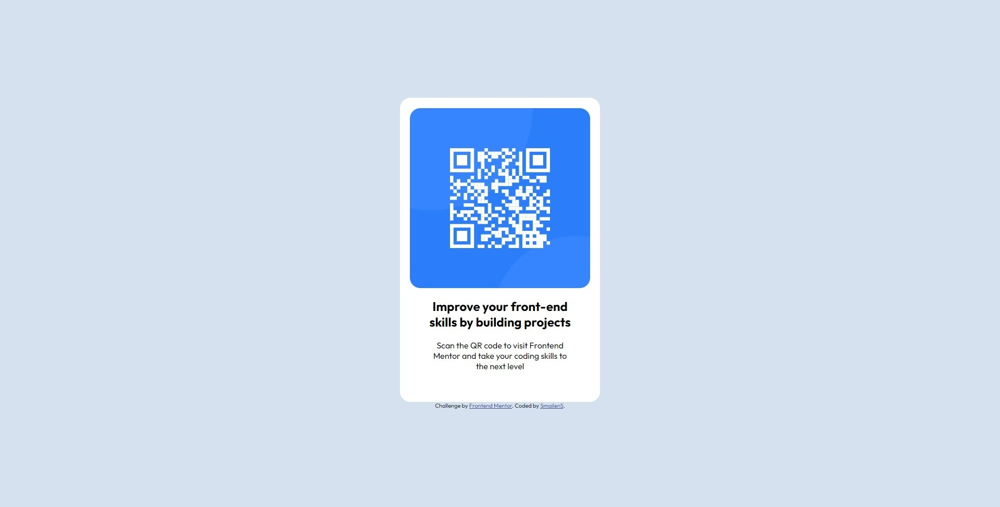

# Frontend Mentor - QR code component

## Welcome! 👋

Thanks for checking out this front-end coding challenge.

## Table of contents

- [Screenshot](#screenshot)
- [Built with](#built-with)
- [Author](#author)

### Screenshot

### Built with

- Semantic HTML5 markup
- CSS custom properties
- Flexbox

## Author

- Frontend Mentor - [@Smailen5](https://www.frontendmentor.io/profile/Smailen5)
- Linkedin - [Smailen Vargas](https://www.linkedin.com/in/smailen-vargas/)

